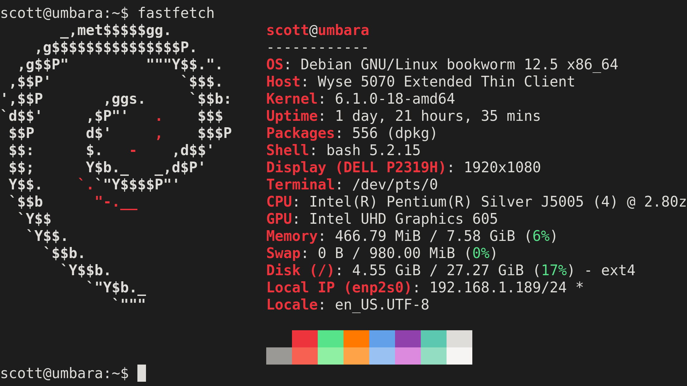

+++
title = "Homebrewing a Debian Linux Router, Part 1"
description = "AKA learning networking the hard way"
tags = ["networking", "homeserver", "linux"]
date = 2024-03-11
+++


My adventures brewing my very own neckbeard router using a Dell Wyse 5070 Extended and Debian GNU/Linux.

This project started after I found a good deal for a Dell Wyse 5070 Extended on eBay. The Dell Wyse is a thin client, a mini-PC meant for connecting to a central server or the cloud, and therefore is not very powerful itself. However, they can still make a very capable router/fireall device, and the extended version comes with a PCIe expansion slot which can be used to add extra NICs. The one I bought on eBay was already being used for this purpose since it came with 4 extra NICs and preloaded with pfSense, an OpenBSD-based firewall OS.

However, I wanted to try a totally custom solution to really teach myself more about networking and for maximum control. So I wiped the pfSense installation and loaded Debian 12.

## Hardware

Obligatory neo/fastfetch:



| Category | Installed |
| --- | --- |
| OS | Debian GNU/Linux bookworm 12.5 |
| Host | Dell Wyse Extend 5070 |
| CPU | Intel Pentium Silver J5005 |
| Graphics | Intel UHD Graphics 605 |
| Memory | 8 GB |
| Disk | 32 GB SSD |

Other than the OS I did not do any hardware upgrades. It came with 8G of RAM and a tiny 32GB SSD (perfect for this use case, anything more would be overkill).


## Basic System Setup

If you're here you and interested in this topic at all then you probably don't need me to tell you how to install Debian, but I will note the installation on this device was very straightforward. Nothing weird, no hiccups, and everything just worked. 

Of course if this device is going to serve as your firewall, you want to make sure it is properly secured. Create an administrator but non-root user, disable password authentication for SSH, setup keys, and setup unattended-upgrades. Debian is a great distro to choose for a custom router setup because you can be confident an update won't take out your connection to the internet and firewall while still providing critical security patches.

## Gateway Configuration

First things first we need to enable forwarding in `sysctl`.

Open the `/etc/sysctl.conf` with your favorite editor and uncomment the following lines:

```
net.ipv4.conf.default.forwading=1
net.ipv4.conf.default.rp_filters=1
net.ipv4.tcp_syncookies=1
```

The first line enables packet forwarding over IPv4. 

The second line, `rp_filter`, stands for reverse path filtering. When the machine receives a packet, it will first check whether the source of that packet is actually reachable. If it is, the packet is accepted, if not, it is dropped. 

The third line which enables SYN cookies. This is to defend against [SYN flood](https://en.wikipedia.org/wiki/SYN_flood) attacks. 

Save and exit, then run `sysctl --system` to reload the sysctl configs.

## Interface Setup

My router has five NICs total. One of these serves as the WAN port and the other four are used for LAN. I setup a bridge device `br0` for the 4 LAN ports.

For the bridge interface, make sure you have `bridge-utils` installed (`sudo apt install bridge-utils`).

My `/etc/network/interfaces`:

```
# The loopback network interface
auto lo
iface lo inet loopback

# The WAN interface
auto enp2s0
allow-hotplug enp2s0
iface enp2s0 inet static
    # IP address of gateway of the parent network
	gateway 192.168.1.254
    # IP address of this device on the parent work
	address 192.168.1.189
	netmask 255.255.255.0

# LAN 1
allow-hotplug enp1s0f0
iface enp1s0f0 inet manual

# LAN 2
allow-hotplug enp1s0f1
iface enp1s0f1 inet manual

# LAN 3
allow-hotplug enp1s0f2
iface enp1s0f2 inet manual

# LAN 4
allow-hotplug enp1s0f3
iface enp1s0f3 inet manual

# Bridge interface. Basically acts as a virtual switch for my four LAN interfaces.
auto br0
iface br0 inet static
	bridge_ports enp1s0f0 enp1s0f1 enp1s0f2 enp1s0f3
    # address of the device on my LAN
	address 172.16.0.1
	netmask 255.255.255.0
	broadcast 172.16.1.255
```

## `iptables` Rules

To setup the actual firewall I am using `iptables`. `iptables` is supposedly going out of fashion and to be replaced with [`nftables`](https://www.nftables.org/), but a lot of software like `ufw` still uses `iptables` and so do a lot of guides and resources out there. So I am using `iptables` for now but in the I future will give `nftables` a try. 

An iptables command looks like `--append --table <table> --in-interface <input-interface> --out-interface <out-interface> --jump <target>`. In English, how you want to add the rule (append/replace/etc), which table you are adding it to (INPUT, FORWARD, NAT, POSTROUTING, or PREROUTING), the input interface, the output interface, and what action iptables should take if the packet is matched (ACCEPT or DROP for example). These rules are known as **chains**.

This allows for traffic on the loopback interface. The loopback device is just the network interface the computer uses to talk to itself:

```
# note FILTER is the default table for iptables so you do not need to specify it here
sudo iptables -A INPUT -i lo -j ACCEPT
sudo iptables -A OUTPUT -o lo -j ACCEPT
```

This permits INPUT and FORWARD traffic that is apart of an establish or related connection. This ensures responses to outgoing HTTP requests are not blocked:

```
sudo iptables -A INPUT -m conntrack --ctstate RELATED,ESTABLISHED -j ACCEPT
sudo iptables -A FORWARD -m conntrack --ctstate RELATED,ESTABLISHED -j ACCEPT
```

This allows for pinging and traceroute requests:

```
sudo iptables -A INPUT -p icmp -j ACCEPT
sudo iptables -A INPUT -p udp -m udp \
--dport 33434:35523 -j REJECT --reject-with icmp-port-unreachable
```
This allows for allowing traffic from LAN to WAN:

```
sudo iptables -A FORWARD -o enp2s0 -i br0 -j ACCEPT
```

This allows to TCP traffic to port 22 from LAN only, 22 being the default port for SSH of course. If you chose to run your SSH server on a different port then you would want to allow that port here instead.

```
sudo iptables -A INPUT -i br0 -p tcp --dport 22 -j ACCEPT
sudo iptables -A INPUT -i br0 -p tcp --dport 22 -j ACCEPT
```

This sets up NAT, AKA Network Address Translation (notice we add it to the NAT table). This is the technology the IP address of the router on the wider network or internet to the IP addresses of individual devices on your LAN.

```
# Remember enp2s0 is the WAN interface
iptables -t nat -A POSTROUTING -o enp2s0 -j MASQUERADE
```

And finally this drops all other INPUT and FORWARD traffic. `iptables` read from the first rule applied to the last, **so make sure you add your DROP rules at the very end!!!**.


```
sudo iptables -A INPUT -j DROP
sudo iptables -A FORWARD -j DROP
```

For debugging the `iptables` firewall and seeing exactly what traffic is being drop, add
 
 ```
iptables -A INPUT -j LOG --log-prefix "INPUT-DROP: " --log-level 7
iptables -A FORWARD -j LOG --log-prefix "FORWARD-DROP: " --log-level 7
 ```
 
 To your rules and look at `dmesg` to see what packets are being dropped. This is how I found out DNS packets were being blocked on my Wireguard interface, causing slow internet speeds.
 
 To persist your rules, install `iptables-persistent`
 
`sudo apt install iptables-persistent` 

Upon install you should get a prompt to save your current `iptables` rules. You can then edit these rules in the file `/etc/iptables/rules.v4`. To reapply the rules restart the iptables service by running `sudo systemctl restart iptables`. 

So currently, out `/etc/iptables/rules.v4` should look something like this:

```
*filter
:INPUT ACCEPT [0:0]
:FORWARD ACCEPT [0:0]
:OUTPUT ACCEPT [0:0]

-A INPUT -i lo -j ACCEPT
-A OUTPUT -o lo -j ACCEPT

-A INPUT -m conntrack --ctstate RELATED,ESTABLISHED -j ACCEPT
-A FORWARD -m conntrack --ctstate RELATED,ESTABLISHED -j ACCEPT

-A INPUT -p icmp -j ACCEPT
-A INPUT -p udp -m udp --dport 33434:35523 -j REJECT --reject-with icmp-port-unreachable

-A FORWARD -o enp2s0 -i br0 -j ACCEPT

-A INPUT -i br0 -p tcp --dport 22 -j ACCEPT
-A INPUT -i br0 -p tcp --dport 22 -j ACCEPT

-A INPUT -j DROP
-A FORWARD -j DROP

-A INPUT -j LOG --log-prefix "INPUT-DROP: " --log-level 7
-A FORWARD -j LOG --log-prefix "FORWARD-DROP: " --log-level 7

*nat
:PREROUTING ACCEPT [0:0]
:INPUT ACCEPT [0:0]
:OUTPUT ACCEPT [0:0]
:POSTROUTING ACCEPT [0:0]

nat -A POSTROUTING -o enp2s0 -j MASQUERADE
```

If you're having issues, remember to have a look at `dmesg -w` to see real-time which packets are being dropped.

## Conclusion

That's all for now. In the next post I will talk about how I setup `dnsmasq` to provide DNS and DHCP services to my LAN, and in later posts I will talk about setting up setting up Wi-Fi, a Wireguard server, Pi-Hole, Unbound, OpenVPN, IPv6, and possibly more.

## References

- [Ars Technica](https://arstechnica.com/gadgets/2016/04/the-ars-guide-to-building-a-linux-router-from-scratch/) (check this article out, it was my initial inspiration for this project)
- [Router Arch Wiki](https://wiki.archlinux.org/title/Router)
- [DigitalOcean](https://www.digitalocean.com/community/tutorials/iptables-essentials-common-firewall-rules-and-commands)
- `man iptables`
