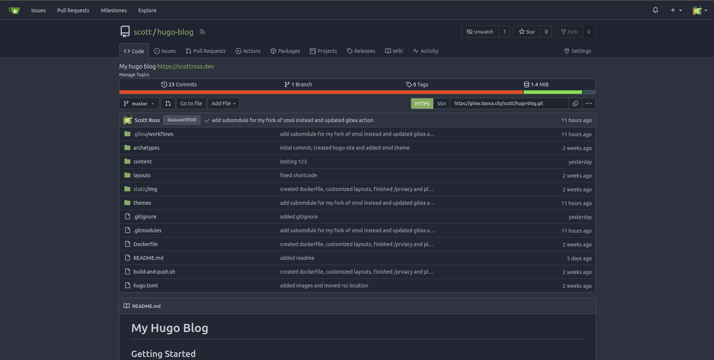

+++
title = "How I Deploy this Site from Self-Hosted Infrastructure"
date = 2024-01-14 
tags = ["webdev", "self-hosting"]
+++

For the first iteration of this site, the repository was hosted on GitHub and the actual site on Netlify. My process for deploying it to Netlify was pretty simple: I wrote a GitHub action which on pushes to master would build the site using zola, then push it to my Netlify site using their official action.

```yaml
name: Zola on Netlify

on:
  push:
    branches: [ master ]
  
jobs:
  build_and_deploy:
    runs-on: ubuntu-22.04
    steps:
      - name: Checkout master
        uses: actions/checkout@v3

      - name: Install and Run Zola
        run: |
          sudo snap install --edge zola
          zola build

      - name: Deploy to Netlify
        uses: netlify/actions/cli@master
        env:
          NETLIFY_AUTH_TOKEN: ${{ secrets.NETLIFY_API_TOKEN }}
          NETLIFY_SITE_ID: ${{ secrets.NETLIFY_SITE_ID }}
        with:
          args: deploy --dir=public --prod
          secrets: '["NETLIFY_AUTH_TOKEN", "NETLIFY_SITE_ID"]'
```

*The action in question*.

This worked fine, but after falling deep down the self-hosting and Linux rabbit hole, I of course thought "wouldn't this be awesome if I deployed and hosted it from my own server?"

## Gitea

So now flash-forward to now, the code is hosted on a self-hosted Gitea repository, with a Gitea action which builds and pushes an image for my compiled static site. That image is then deployed as a container on my server.

```yaml
name: Build Docker Image and Publish to Local Registry
run-name: Build and Publish Image
on:
  push:
    branches: master

jobs:
  build-and-publish:
    runs-on: ubuntu-latest 
    steps:
      - name: Checkout repository
        uses: actions/checkout@v3
        with:
          ref: master

      - name: Install Hugo
        run: apt update -y && apt install hugo -y

      - name: Update Submodules
        run: git submodule update --init --recursive

      - name: Build Hugo
        run: hugo --config hugo.toml

      - name: Install Docker
        run: curl -fsSL https://get.docker.com | sh

      - name: Setup QEMU
        uses: https://github.com/docker/setup-qemu-action@v3
        
      - name: Set up Docker Buildx
        uses: https://github.com/docker/setup-buildx-action@v3
     
      - name: Build and push
        uses: https://github.com/docker/build-push-action@v5
        env:
          ACTIONS_RUNTIME_TOKEN: '' # See https://gitea.com/gitea/act_runner/issues/119
        with:
          context: .
          file: ./Dockerfile
          platforms: |
            linux/amd64            
          push: true
          tags: |
            ${{ vars.REGISTRY }}/${{ vars.IMAGE }}:${{ vars.TAG }}            
```

*New action.*

If you don't know, [Gitea](https://github.com/go-gitea/gitea) is an open-source and self-hosted alternative to GitHub. Visually Gitea looks similar to GitHub and also has a lot of the same features, including Actions.



*Gitea repo for this site*

The workflow syntax and Actions UI is basically identical to Gihtub, however there are some capabilities missing when compared to GitHub Actions. But there are also a couple extra features that Gitea actions has, such as writing actions in Go.

If you self-host Gitea and want to use actions, you need to setup the Gitea act runner. [Act](https://github.com/nektos/act) is a cool project for running GitHub actions locally using docker, and this is the underlying tool Gitea actions uses to run actions. Please note though, these containers Act and Gitea Actions use for running jobs **are not** the same as the runners GitHub uses to to run jobs. GitHub actions use full VMs, not containers, and come extra tools that may missing from the containers used by Act. For example, the `ubuntu-latest` tag in the action above actually corresponds to a Debian bookworm container, and it does not come with docker installed by default, hence the extra Docker installation step.

You can setup the Gitea Act Runner by following the official documentation [here](https://docs.gitea.com/next/usage/actions/quickstart). I have set it up using docker. If you need a reference, here is my docker compose service for the act runner:

```yaml
runner:
	image: gitea/act_runner
	depends_on:
		- server # gitea service is called server
	volumes:
		- act-runner:/data
		- /var/run/docker.sock:/var/run/docker.sock
		- ./config.yaml:/config.yaml
	secrets:
		- runner_registration_token
	environment:
		- CONFIG_FILE: /config.yaml
      	- GITEA_INSTANCE_URL: ${INSTANCE_URL}
      	- GITEA_RUNNER_REGISTRATION_TOKEN_FILE: /run/secrets/runner_registration_token
      	- GITEA_RUNNER_NAME: gitea-runner-1
      	- GITEA_RUNNER_LABELS: ubuntu-latest:docker://debian:bookworm,ubuntu-22.04:docker://debian:bookworm,ubuntu-20.04:docker://debian:bullseye,ubuntu-18.04:docker://debian:buster,cth-ubuntu-latest:docker://catthehacker/ubuntu:act-latest
     networks:
     	- gitea
     restart: 'unless-stopped'
```

## Deploying

The site is deployed as a container using docker compose. The Dockerfile used to build the image is very simple,

```dockerfile
FROM nginx
COPY public /usr/share/nginx/html
```

After I run `hugo` the site is built into the `public` folder. I am using `nginx` as a base image and just copying the compiled site into the appropriate place.

Then on my server I deploy it using a docker compose file like this:

```yaml
---
services:
  hugo-blog:
    image: ${REGISTRY}/hugo-blog
    network_mode: 'container:public'
```

Done.

## Making it Accessible

To make my site accessible to the world, I don't actually open any ports on my home network. Instead, I have cloud VPS which acts as a proxy server for everything I host publicly.

I would like to make a part 2 with a more detailed guide on how I set this up, but basically I use a Wireguard tunnel to connect the containers on my home server to the VPS and use nginx as a reverse proxy on the VPS. I use a gluetun container as a client to my Wireguard server on the VPS, and then for any service I want to expose publicly I connect to that container to glueutn by adding `network_mode: 'container:public'` to the compose.yaml.

[Gluetun](https://github.com/qdm12/gluetun) is a VPN client container which you can then route other container's traffic through so they can also use the VPN connection. It supports a variety of VPN providers as well as custom OpenVPN and Wireguard setups. Very cool project, check it out.

After this I write an nginx config for the site I want to expose on the VPS and proxy pass to the appropriate Wireguard IP address and port that application is exposed on. 

That's all until part 2, where I will go into detail on how these services are exposed publicly, but for now I hope this gave you some ideas for how to deploy your own site from your own machine.
